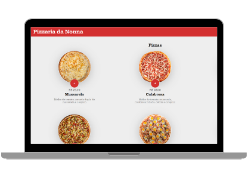

<h1 align="center"> Pizzaria </h1>

Projeto de sistema de delivery de pizzaria.  

  <a href="#-tecnologias">Tecnologias</a>&nbsp;&nbsp;&nbsp;|&nbsp;&nbsp;&nbsp;
  <a href="#-projeto">Projeto</a>&nbsp;&nbsp;&nbsp;|&nbsp;&nbsp;&nbsp;

  

## 🚀 Tecnologias

Esse projeto foi desenvolvido com as seguintes tecnologias:

- HTML e CSS
- JavaScript
- Git e Github

## 💻 Projeto

A pizzaria da nonna é um projeto de sistema de delivery de pizzaria.

- [Acesse o projeto finalizado, online](https://gabicavalheiro.github.io/pizzaria-da-nonna)

